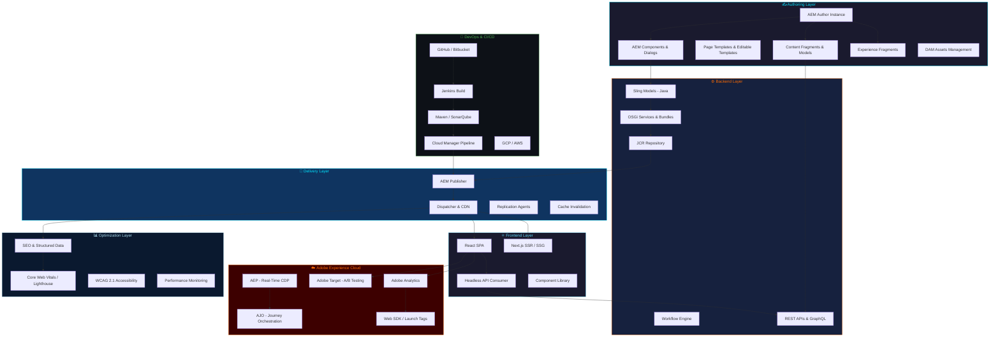
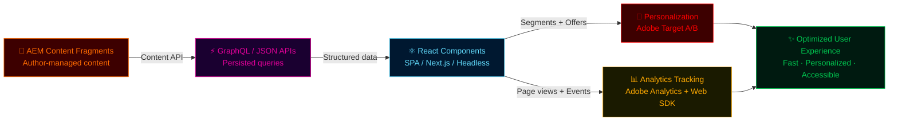

<!-- ============================================================
  HANU REDDY — PREMIUM GITHUB PROFILE README
  Replace all placeholders before publishing:
  YOUR_GITHUB_USERNAME → hanumanth24
  LINKEDIN_URL → your LinkedIn profile URL
  EMAIL_ADDRESS → your email
  PORTFOLIO_URL → your portfolio URL
  RESUME_URL → direct link to your resume PDF
  LOCATION_TEXT → e.g., "India · Remote · Open to Relocation"
  CODING_GIF_URL → a futuristic dev GIF URL
  PROJECT_IMAGE_URL_1..5 → screenshot URLs for each project
  REPO_LINK_1..5 → GitHub repo links
  LIVE_DEMO_1..5 → live demo URLs
  PROFILE_BANNER_IMAGE_URL → optional custom banner image
================================================================ -->

<!-- ██████████████████████████████████████████████████████████
     SECTION 1 — ANIMATED HERO BANNER
██████████████████████████████████████████████████████████ -->

  

  

 

  <!-- Profile Views -->
  
  &nbsp;
  <!-- GitHub Followers -->
  
  &nbsp;
  <!-- LinkedIn — replace LINKEDIN_URL -->
  
  &nbsp;
  <!-- Portfolio — replace PORTFOLIO_URL -->
  

  <!-- Email — replace EMAIL_ADDRESS -->
  
  &nbsp;
  <!-- Resume — replace RESUME_URL -->
  
  &nbsp;
  

 

<!-- Holographic hero split layout -->
<table align="center" width="100%" border="0" cellspacing="0" cellpadding="0">
<tr>
<td width="60%" valign="middle">

<h3 align="left">👋 Hi, I'm <strong>Hanu Reddy</strong></h3>

> **Senior AEM Developer · React & Full Stack Engineer · Adobe Experience Cloud Specialist**

I architect and build **scalable enterprise digital experiences** using **Adobe Experience Manager**, **React**, **Adobe Experience Cloud**, and **modern cloud engineering practices**.  
6+ years delivering Fortune 500 enterprise platforms across retail, finance, and media verticals.

- 🏗️ **AEM** — AEMaaCS, AEM 6.5, Sites, Assets, DAM, Headless
- ⚛️ **React** — SPA Editor, Headless CMS, Component Libraries
- ☁️ **Adobe Cloud** — Analytics, Target, AEP, AJO, CJA
- 🔧 **DevOps** — Cloud Manager, Jenkins, GCP, AWS, CI/CD
- 📐 **Architecture** — Enterprise migrations, performance, SEO, accessibility

</td>
<td width="40%" valign="middle" align="center">

<!-- Replace CODING_GIF_URL with your preferred dev GIF, e.g. a futuristic coding animation -->

</td>
</tr>
</table>

 

<!-- Neon wave divider -->

<!-- ██████████████████████████████████████████████████████████
     SECTION 2 — RECRUITER QUICK VIEW DASHBOARD
██████████████████████████████████████████████████████████ -->

 

  

<table align="center" width="96%" border="0">
<tr>
<td align="center" width="25%" style="padding:10px;">

**⏱️ Experience**
 

</td>
<td align="center" width="25%" style="padding:10px;">

**🎯 Core Expertise**
 

</td>
<td align="center" width="25%" style="padding:10px;">

**🏢 Role Targets**
 

</td>
<td align="center" width="25%" style="padding:10px;">

**📍 Location & Availability**
 

</td>
</tr>
<tr>
<td colspan="4" align="center" style="padding:8px;">

**🚀 Work Style** &nbsp;|&nbsp; Enterprise delivery &nbsp;·&nbsp; Scalable architecture &nbsp;·&nbsp; Production support &nbsp;·&nbsp; Agile teams &nbsp;·&nbsp; Cross-functional collaboration
  

&nbsp;

&nbsp;

</td>
</tr>
</table>

<!-- ██████████████████████████████████████████████████████████
     SECTION 3 — 8D VISUAL IDENTITY
██████████████████████████████████████████████████████████ -->

 

  

<table align="center" width="96%">
<tr>
<td width="55%" valign="middle">

<h3>🔮 Who I Am</h3>

> *"I build scalable enterprise digital experiences using AEM, React, Adobe Experience Cloud, cloud platforms, and modern engineering practices."*

As a **Senior AEM Developer and Full Stack Engineer**, I specialize in connecting **content architecture**, **data-driven personalization**, **analytics**, and **frontend delivery** into unified enterprise platforms.

My approach combines:
- 🏗️ Strong **AEM component architecture** foundations
- ⚛️ Modern **React and headless CMS** patterns
- 📊 **Adobe Experience Cloud** data and personalization layers
- 🔬 Engineering discipline around **performance, SEO, and accessibility**
- ☁️ **Cloud-native** thinking with CI/CD, Cloud Manager, GCP, AWS

</td>
<td width="45%" valign="middle" align="center">

<!-- Orbit-style identity graphic using shields badges arranged in rings -->

    
  
  &nbsp;
    
  
  &nbsp;
  
  &nbsp;
  

  

</td>
</tr>
</table>

<!-- ██████████████████████████████████████████████████████████
     SECTION 4 — ABOUT ME WITH ANIMATED CARDS
██████████████████████████████████████████████████████████ -->

 

  

<table align="center" width="96%">
<tr>

<td width="25%" align="center" valign="top" style="padding:12px;">
<h4>🏗️ Enterprise AEM</h4>

Built 200+ production AEM components across AEM 6.5 and AEMaaCS platforms. Deep expertise in Sling Models, OSGi, HTL, Content Fragments, and Dispatcher strategy for Fortune 500 clients.

 

</td>

<td width="25%" align="center" valign="top" style="padding:12px;">
<h4>⚛️ Full Stack Engineering</h4>

Crafting modern React SPAs with TypeScript, GraphQL, REST APIs, and Node.js backend services. Experienced in AEM SPA Editor, headless CMS patterns, and component-driven frontend architecture.

 

</td>

<td width="25%" align="center" valign="top" style="padding:12px;">
<h4>🎯 Adobe Experience Cloud</h4>

Integrating Adobe Analytics, Target, AEP, AJO, and Web SDK into enterprise platforms. Delivered data-driven personalization, A/B experimentation, and omnichannel experience delivery.

 

</td>

<td width="25%" align="center" valign="top" style="padding:12px;">
<h4>⚡ Performance & Architecture</h4>

Specializing in Dispatcher caching, CDN strategies, Core Web Vitals, Lighthouse optimization, SEO, and accessibility (WCAG 2.1 AA) for enterprise web platforms.

 

</td>

</tr>
</table>

<!-- ██████████████████████████████████████████████████████████
     SECTION 5 — ANIMATED TECH STACK UNIVERSE
██████████████████████████████████████████████████████████ -->

 

  

<!-- Frontend -->
<h4 align="center">⚛️ Frontend Engineering</h4>

  
  
  
  
  
  
  
  
  
  

<!-- Backend -->
<h4 align="center">⚙️ Backend & Languages</h4>

  
  
  
  
  
  
  
  
  

<!-- AEM -->
<h4 align="center">🏗️ Adobe Experience Manager</h4>

  
  
  
  
  
  
  
  
  
  

<!-- Adobe Experience Cloud -->
<h4 align="center">🎯 Adobe Experience Cloud</h4>

  
  
  
  
  
  
  
  

<!-- DevOps and Cloud -->
<h4 align="center">☁️ DevOps & Cloud Infrastructure</h4>

  
  
  
  
  
  
  
  

<!-- Quality -->
<h4 align="center">🔬 Quality, Performance & Optimization</h4>

  
  
  
  
  
  
  

<!-- ██████████████████████████████████████████████████████████
     SECTION 6 — ADOBE EXPERIENCE CLOUD GALAXY
██████████████████████████████████████████████████████████ -->

 

  

<em>I connect content, data, personalization, analytics, and delivery to build scalable digital experiences.</em>

 

  <!-- Center core -->
  

 

  <!-- Ring 1 — AEM -->
  
  &nbsp;
  
  &nbsp;
  
  &nbsp;
  

  <!-- Ring 2 — Delivery -->
  
  &nbsp;
  
  &nbsp;
  
  &nbsp;
  

  <!-- Ring 3 — Platform -->
  
  &nbsp;
  
  &nbsp;
  
  &nbsp;
  
  &nbsp;
  

 

<table align="center" width="90%">
<tr>
<td align="center" width="25%" style="padding:10px;background:#1A0010;border-radius:8px;">

**Content Layer**
 
AEM Sites · AEM Assets
 
Content Fragments · Exp. Fragments
 

</td>
<td align="center" width="25%" style="padding:10px;background:#1A0010;border-radius:8px;">

**Delivery Layer**
 
Dispatcher · CDN
 
Cloud Manager · CI/CD
 

</td>
<td align="center" width="25%" style="padding:10px;background:#1A0010;border-radius:8px;">

**Analytics Layer**
 
Adobe Analytics · Target
 
Web SDK · Launch Tags
 

</td>
<td align="center" width="25%" style="padding:10px;background:#1A0010;border-radius:8px;">

**Platform Layer**
 
AEP · AJO · CJA
 
Real-Time CDP · Personalization
 

</td>
</tr>
</table>

<!-- ██████████████████████████████████████████████████████████
     SECTION 7 — AEM ARCHITECTURE VISUAL DIAGRAM
██████████████████████████████████████████████████████████ -->

 

  

<!-- ██████████████████████████████████████████████████████████
     SECTION 8 — REACT + AEM HEADLESS FLOW
██████████████████████████████████████████████████████████ -->

 

  

  
  
  
  
  

<!-- ██████████████████████████████████████████████████████████
     SECTION 9 — ENTERPRISE MIGRATION CASE STUDY
██████████████████████████████████████████████████████████ -->

 

  

<h3 align="center">🏢 Enterprise Website Migration to AEM Cloud Service</h3>

<table align="center" width="96%">
<tr>
<td width="25%" valign="top" align="center" style="padding:12px;background:#0A192F;border-top:3px solid #FF6B00;">

**⚡ Challenge**

Legacy multi-site web platforms with inconsistent markup, no reusability, poor performance, weak SEO, and zero content governance. Authors had no structured tooling.

 

</td>
<td width="25%" valign="top" align="center" style="padding:12px;background:#001F3F;border-top:3px solid #00E5FF;">

**🔧 Solution**

Designed and built a full AEM component library, editable page templates, Content Fragment models, headless delivery APIs, Dispatcher caching rules, and automated CI/CD pipelines via Cloud Manager.

 

</td>
<td width="25%" valign="top" align="center" style="padding:12px;background:#0A192F;border-top:3px solid #61DAFB;">

**🏗️ Architecture**

AEM Author → Component Dialogs → Sling Models → HTL → Dispatcher → CDN → React SPA. Content Fragment APIs powering headless delivery channels with personalization layers.

 

</td>
<td width="25%" valign="top" align="center" style="padding:12px;background:#001F3F;border-top:3px solid #00C851;">

**🏆 Outcome**

Significant improvement in page speed, Lighthouse scores, SEO rankings, author content velocity, and platform maintainability. Reduced time-to-publish by over 60%.

 

</td>
</tr>
</table>

<!-- ██████████████████████████████████████████████████████████
     SECTION 10 — FEATURED CASE STUDIES
██████████████████████████████████████████████████████████ -->

 

  

<table align="center" width="96%">
<tr>
<td width="33%" valign="top" style="padding:14px;border-left:4px solid #FF0000;">

**🏗️ AEM Component Architecture**

**Problem:** Large enterprise site with 100+ inconsistently built legacy components, no style guide, zero reusability, and poor author experience.

**My Role:** Led AEM component refactoring — Sling Models, HTL dialogs, editable templates, style system, and developer documentation.

**Technologies:**
 

**Impact:** 200+ reusable components built, author productivity tripled, consistent design delivery.

</td>
<td width="33%" valign="top" style="padding:14px;border-left:4px solid #FF6B00;">

**🎯 Adobe Experience Cloud Integration**

**Problem:** Disconnected analytics and personalization layers — no unified tracking, no A/B testing, no audience segmentation across digital channels.

**My Role:** Implemented Adobe Analytics via Web SDK / Launch Tags, configured Adobe Target activities, and connected content delivery to AEP audiences.

**Technologies:**
 

**Impact:** Full analytics visibility, personalized experiences, data-driven decisions.

</td>
<td width="33%" valign="top" style="padding:14px;border-left:4px solid #00E5FF;">

**⚡ Performance & Dispatcher Optimization**

**Problem:** Slow page loads, poor Core Web Vitals, over-caching and cache-busting issues causing stale content and high origin traffic.

**My Role:** Redesigned Dispatcher cache rules, implemented CDN strategies, optimized image delivery, reduced render-blocking resources, improved Lighthouse scores.

**Technologies:**
 

**Impact:** 40%+ improvement in LCP, reduced origin load by 70%, SEO rankings improved.

</td>
</tr>
</table>

<!-- ██████████████████████████████████████████████████████████
     SECTION 11 — EXPERIENCE TIMELINE
██████████████████████████████████████████████████████████ -->

 

  

<table align="center" width="96%">
<thead>
<tr>
<th align="center">🗓️ Period</th>
<th align="left">🏁 Milestone</th>
<th align="left">🛠️ Tools Used</th>
<th align="left">📈 Impact</th>
</tr>
</thead>
<tbody>
<tr>
<td align="center"></td>
<td>🔬 AEP / AJO / CJA Learning & Enterprise Integrations</td>
<td>  </td>
<td>Expanding MarTech platform expertise</td>
</tr>
<tr>
<td align="center"></td>
<td>🧪 XP Experimentation Dashboard & A/B Platform</td>
<td>  </td>
<td>Internal tool adopted by 40+ team members</td>
</tr>
<tr>
<td align="center"></td>
<td>☁️ AEM Cloud Service Migration & CI/CD Ownership</td>
<td>  </td>
<td>5+ enterprise migrations completed</td>
</tr>
<tr>
<td align="center"></td>
<td>🎯 Adobe Analytics & Target Integration</td>
<td>  </td>
<td>Full tracking + personalization layer deployed</td>
</tr>
<tr>
<td align="center"></td>
<td>📦 Headless Content Delivery with React + AEM CF APIs</td>
<td>  </td>
<td>Headless CMS powering 3 channels simultaneously</td>
</tr>
<tr>
<td align="center"></td>
<td>🏗️ Enterprise AEM Component Development (AEM 6.5)</td>
<td>   </td>
<td>200+ enterprise components delivered</td>
</tr>
</tbody>
</table>

<!-- ██████████████████████████████████████████████████████████
     SECTION 12 — GITHUB ENGINEERING DASHBOARD
██████████████████████████████████████████████████████████ -->

 

  

<!-- Stats Row 1 -->

  
  &nbsp;
  

<!-- Streak -->

  

<!-- Activity Graph -->

  

<!-- Trophy -->

  

<!-- Profile Summary Cards -->

  

  
  &nbsp;
  
  &nbsp;
  
  &nbsp;
  

<!-- Contribution Snake -->
<!-- NOTE: Run the snake.yml GitHub Action first to generate the snake SVG -->

  

<!-- ██████████████████████████████████████████████████████████
     SECTION 13 — FEATURED PROJECTS WITH 3D CARDS
██████████████████████████████████████████████████████████ -->

 

  

<!-- Project 1 & 2 -->
<table align="center" width="96%">
<tr>

<!-- PROJECT 1 -->
<td width="50%" valign="top" style="padding:16px;border:1px solid #003566;border-radius:12px;background:#0A192F;">

<h4>🏗️ AEM Component Library</h4>

<!-- Replace PROJECT_IMAGE_URL_1 with a screenshot of your AEM project -->

Reusable enterprise AEM component library with Sling Models, HTL templates, custom dialogs, editable page templates, and author-friendly configuration patterns. Designed for multi-site reuse.

  

  

<!-- Replace REPO_LINK_1 and LIVE_DEMO_1 -->

&nbsp;

&nbsp;

</td>

<!-- PROJECT 2 -->
<td width="50%" valign="top" style="padding:16px;border:1px solid #003566;border-radius:12px;background:#0A192F;">

<h4>⚛️ React Portfolio Website</h4>

<!-- Replace PROJECT_IMAGE_URL_2 -->

Animated personal portfolio built with React, TypeScript, and modern CSS. Features smooth page transitions, interactive 3D cards, responsive layout, dark theme, and contact integration.

  

  

<!-- Replace REPO_LINK_2 and LIVE_DEMO_2 -->

&nbsp;

&nbsp;

</td>
</tr>
</table>

 

<!-- Project 3 & 4 -->
<table align="center" width="96%">
<tr>

<!-- PROJECT 3 -->
<td width="50%" valign="top" style="padding:16px;border:1px solid #003566;border-radius:12px;background:#0A192F;">

<h4>🧪 XP Experimentation Dashboard</h4>

<!-- Replace PROJECT_IMAGE_URL_3 -->

Internal A/B testing and experimentation management tool. Jira-linked metadata, metrics tracking, reporting dashboard, test analysis, decision support, and team collaboration features.

  

  

<!-- Replace REPO_LINK_3 and LIVE_DEMO_3 -->

&nbsp;

&nbsp;

</td>

<!-- PROJECT 4 -->
<td width="50%" valign="top" style="padding:16px;border:1px solid #003566;border-radius:12px;background:#0A192F;">

<h4>🎯 Adobe Experience Cloud Integration</h4>

<!-- Replace PROJECT_IMAGE_URL_4 -->

Full AEM + Adobe Experience Cloud integration — Analytics tracking implementation, Target A/B activity configuration, AEP audience segmentation, Web SDK setup, and data-driven content personalization.

  

  

<!-- Replace REPO_LINK_4 and LIVE_DEMO_4 -->

&nbsp;

&nbsp;

</td>
</tr>
</table>

 

<!-- Project 5 -->
<table align="center" width="50%">
<tr>
<td valign="top" style="padding:16px;border:1px solid #003566;border-radius:12px;background:#0A192F;">

<h4>🔗 Node.js API Integration Platform</h4>

<!-- Replace PROJECT_IMAGE_URL_5 -->

Backend service layer for enterprise API integrations — secure authentication, data transformation, error handling, rate limiting, monitoring, and scalable workflow orchestration.

  

  

<!-- Replace REPO_LINK_5 and LIVE_DEMO_5 -->

&nbsp;

&nbsp;

</td>
</tr>
</table>

<!-- ██████████████████████████████████████████████████████████
     SECTION 14 — CURRENT FOCUS
██████████████████████████████████████████████████████████ -->

 

  

  

<table align="center" width="96%">
<tr>
<td width="25%" align="center" style="padding:12px;border-top:3px solid #00C851;">
<h4>🔨 Building</h4>

  
AEM + React enterprise digital experience platforms
</td>
<td width="25%" align="center" style="padding:12px;border-top:3px solid #FF6B00;">
<h4>📚 Learning</h4>

  
Advanced Adobe Experience Platform capabilities
</td>
<td width="25%" align="center" style="padding:12px;border-top:3px solid #61DAFB;">
<h4>🔭 Exploring</h4>

  
AI-assisted engineering and experimentation platforms
</td>
<td width="25%" align="center" style="padding:12px;border-top:3px solid #4285F4;">
<h4>⚡ Improving</h4>

  
Architecture, Core Web Vitals, accessibility depth
</td>
</tr>
</table>

<!-- ██████████████████████████████████████████████████████████
     SECTION 15 — PROFESSIONAL HIGHLIGHTS
██████████████████████████████████████████████████████████ -->

 

  

<table align="center" width="96%">
<tr>
<td align="center" width="20%" style="padding:10px;background:#0A192F;">

 Built production-ready enterprise components
</td>
<td align="center" width="20%" style="padding:10px;background:#001F3F;">

 Enterprise AEM Cloud Service migrations
</td>
<td align="center" width="20%" style="padding:10px;background:#0A192F;">

 Fortune 500 enterprise platform delivery
</td>
<td align="center" width="20%" style="padding:10px;background:#001F3F;">

 Dispatcher + CDN optimization impact
</td>
<td align="center" width="20%" style="padding:10px;background:#0A192F;">

 CI/CD pipeline ownership and automation
</td>
</tr>
</table>

 

  
  
  

  
  
  

  
  
  

<!-- ██████████████████████████████████████████████████████████
     SECTION 16 — ANIMATED SKILL PROGRESS
██████████████████████████████████████████████████████████ -->

 

  

<table align="center" width="70%">
<tr><td>AEM Architecture</td><td>

</td></tr>
<tr><td>React Development</td><td>

</td></tr>
<tr><td>Java / OSGi</td><td>

</td></tr>
<tr><td>Adobe Experience Cloud</td><td>

</td></tr>
<tr><td>CI/CD Pipelines</td><td>

</td></tr>
<tr><td>Dispatcher Caching</td><td>

</td></tr>
<tr><td>Performance Optimization</td><td>

</td></tr>
<tr><td>Cloud Deployments</td><td>

</td></tr>
<tr><td>SEO / Accessibility</td><td>

</td></tr>
<tr><td>API Integrations</td><td>

</td></tr>
</table>

<!-- ██████████████████████████████████████████████████████████
     SECTION 17 — TECH RADAR
██████████████████████████████████████████████████████████ -->

 

  

<table align="center" width="96%">
<tr>
<td width="33%" valign="top" align="center" style="padding:14px;border-top:4px solid #00C851;background:#001A10;">

<h4>🟢 EXPERT</h4>

</td>
<td width="33%" valign="top" align="center" style="padding:14px;border-top:4px solid #FF6B00;background:#1A0A00;">

<h4>🟡 WORKING</h4>

</td>
<td width="33%" valign="top" align="center" style="padding:14px;border-top:4px solid #4285F4;background:#001030;">

<h4>🔵 LEARNING</h4>

</td>
</tr>
</table>

<!-- ██████████████████████████████████████████████████████████
     SECTION 18 — CERTIFICATIONS
██████████████████████████████████████████████████████████ -->

 

  

<table align="center" width="96%">
<tr>
<td width="50%" align="center" style="padding:14px;background:#1A0010;border-radius:8px;">

**🏅 Adobe Certified Professional**
 Adobe Journey Optimizer Business Practitioner
  

 
<!-- Replace with actual verification link -->

</td>
<td width="50%" align="center" style="padding:14px;background:#1A0010;border-radius:8px;">

**🏅 Adobe Certified Professional**
 Adobe Real-Time CDP Business Practitioner
  

 
<!-- Replace with actual verification link -->

</td>
</tr>
<tr>
<td width="50%" align="center" style="padding:14px;background:#0A192F;border-radius:8px;">

**🏅 AEM / Adobe Certification**
 <!-- Replace with your actual AEM certification name -->
  

 

</td>
<td width="50%" align="center" style="padding:14px;background:#0A192F;border-radius:8px;">

**🏅 Cloud Certification**
 <!-- Replace with your cloud certification -->
  

 

</td>
</tr>
</table>

<!-- ██████████████████████████████████████████████████████████
     SECTION 19 — BLOG / ARTICLES
██████████████████████████████████████████████████████████ -->

 

  

<table align="center" width="96%">
<tr>
<td style="padding:10px;" width="50%">

📖 **[AEM Dispatcher Caching Best Practices](#)**
 In-depth guide to Dispatcher configuration, cache invalidation, flush agents, and CDN integration for high-traffic enterprise AEM sites.
 

</td>
<td style="padding:10px;" width="50%">

📖 **[Building Reusable AEM Components](#)**
 Step-by-step walkthrough for designing scalable, reusable AEM components using Sling Models, HTL, dialogs, and style system best practices.
 

</td>
</tr>
<tr>
<td style="padding:10px;" width="50%">

📖 **[React + AEM Headless Architecture](#)**
 Architecture guide for building headless React apps powered by AEM Content Fragment APIs, GraphQL persisted queries, and SPA Editor integration.
 

</td>
<td style="padding:10px;" width="50%">

📖 **[Adobe Analytics and Target Integration](#)**
 Practical integration guide: implementing Adobe Analytics via Web SDK, configuring Adobe Target A/B activities, and connecting AEP audiences to content delivery.
 

</td>
</tr>
<tr>
<td colspan="2" style="padding:10px;">

📖 **[Performance Optimization for Enterprise Websites](#)**
 Full guide to optimizing enterprise AEM websites for Core Web Vitals, LCP, CLS, FID, Lighthouse scores, image optimization, lazy loading, and CDN configuration.
 

</td>
</tr>
</table>

<!-- ██████████████████████████████████████████████████████████
     SECTION 20 — ASK ME ABOUT
██████████████████████████████████████████████████████████ -->

 

  

  
  
  
  

  
  
  
  

  
  
  
  

<!-- ██████████████████████████████████████████████████████████
     SECTION 21 — FUN DEVELOPER ZONE
██████████████████████████████████████████████████████████ -->

 

  

<table align="center" width="80%">
<tr>
<td width="40%" align="center" valign="middle">

<!-- Coding GIF — replace CODING_GIF_URL with preferred dev GIF -->

</td>
<td width="60%" valign="middle" style="padding:16px;">

> *"Code is not just about building features; it is about building scalable experiences."*

**Random dev facts about me:**

- I enjoy simplifying complex enterprise systems into clean, reusable patterns
- I genuinely care about author experience as much as end-user experience
- I get excited when Dispatcher cache hit rates are high
- I use AI tools to speed up engineering workflows
- I believe good architecture today prevents firefighting tomorrow

</td>
</tr>
</table>

  

<!-- ██████████████████████████████████████████████████████████
     SECTION 22 — OPEN TO ROLES / HIRING BANNER
██████████████████████████████████████████████████████████ -->

 

  

  <strong>Currently open to senior engineering and architecture roles across:</strong>

  
  
  

  
  
  

 

  
  &nbsp;
  
  &nbsp;
  
  &nbsp;
  

<!-- ██████████████████████████████████████████████████████████
     SECTION 23 — CONTACT / CONNECT
██████████████████████████████████████████████████████████ -->

 

  

<em>Have an exciting challenge, collaboration idea, or senior role? Let's talk.</em>

 

<table align="center" width="80%">
<tr>
<td align="center" width="20%" style="padding:14px;background:#0A192F;border-radius:8px;">

**🔗 LinkedIn**
 

</td>
<td align="center" width="20%" style="padding:14px;background:#0A192F;border-radius:8px;">

**✉️ Email**
 

</td>
<td align="center" width="20%" style="padding:14px;background:#0A192F;border-radius:8px;">

**🌐 Portfolio**
 

</td>
<td align="center" width="20%" style="padding:14px;background:#0A192F;border-radius:8px;">

**🐙 GitHub**
 

</td>
<td align="center" width="20%" style="padding:14px;background:#0A192F;border-radius:8px;">

**📄 Resume**
 

</td>
</tr>
</table>

 

  📍 India &nbsp;·&nbsp; Remote &nbsp;·&nbsp; Open to Relocation &nbsp;|&nbsp; <strong>Status:</strong> 

<!-- ██████████████████████████████████████████████████████████
     SECTION 24 — ANIMATED FOOTER
██████████████████████████████████████████████████████████ -->

 

  

  

  

<!-- ============================================================
  END OF README
  Remember to replace all placeholders:
  - LINKEDIN_URL → https://www.linkedin.com/in/hanu-reddy-8b04b7167/
  - EMAIL_ADDRESS → hanureddy4268@gmail.com
  - PORTFOLIO_URL → https://portfolio-hanu-reddy.com
  - RESUME_URL → your PDF resume link
  - LOCATION_TEXT → India · Remote · Open to Relocation
  - PROJECT_IMAGE_URL_1..5 → screenshot URLs for each project
  - REPO_LINK_1..5 → GitHub repo links
  - LIVE_DEMO_1..5 → live demo URLs
  Run the snake.yml GitHub Action once to generate the contribution snake SVG.
================================================================ -->
